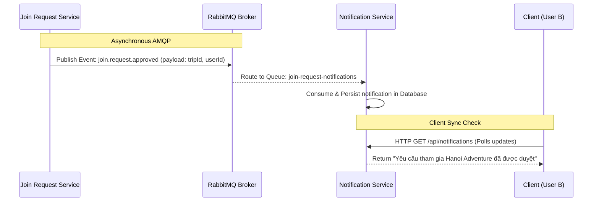
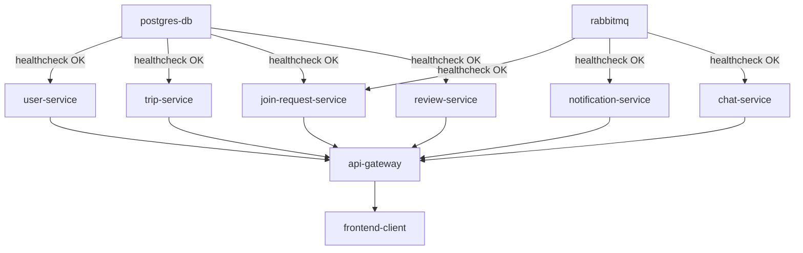

# 🏗️ Microservices System Architecture

This document details the system design, communication patterns, and infrastructure orchestration for the **Travel Buddy Finder** microservices platform.

---

## 🗺️ Architectural Topology Diagram

The diagram below outlines the routing logic, authentication validation, inter-service notifications, and database dependencies.

```text
                                    +-----------------------+
                                    |     Web Client        |
                                    | (React v18 + Vite.js) |
                                    +-----------+-----------+
                                                |
                                                | HTTP REST / WebSockets
                                                v
                                    +-----------------------+
                                    |    Reverse Proxy      |
                                    |      API Gateway      | (Express.js Gateway - Port 3000)
                                    |  [Rate Limit / JWT]   |
                                    +-----------+-----------+
                                                |
        +-----------------------+---------------+---------------+-----------------------+-----------------------+
        | HTTP (Proxy)          | HTTP (Proxy)                  | HTTP (Proxy)          | HTTP (Proxy)          | HTTP / WS (Proxy)
        v                       v                               v                       v                       v
+---------------+       +---------------+               +---------------+       +---------------+       +---------------+
| User Service  |       | Trip Service  |               | Join Request  |       | Review Service|       | Chat Service  |
| (Spring Boot) |       | (Node/Express)|               | (Node/Express)|       | (Spring Boot) |       | (Node/Express)|
|  [Port 8081]  |       |  [Port 8082]  |               |  [Port 8083]  |       |  [Port 8086]  |       |  [Port 8085]  |
+-------+-------+       +-------+-------+               +-------+-------+       +-------+-------+       +-------+-------+
        |                       |                               |                       |                       |
        |                       |                               | Event Publish         |                       | Chat Rooms
        |                       |                               | (AMQP)                |                       | Sync
        |                       |                               v                       |                       v
        |                       |                     +-------------------+             |             +-------------------+
        |                       |                     |   RabbitMQ Broker |             |             |   RabbitMQ Broker |
        |                       |                     |   (Port 5672)     |             |             |    (amq.topic)    |
        |                       |                     +---------+---------+             |             +---------+---------+
        |                       |                               |                       |                       ^
        |                       |                               | Event Consume         |                       | WS Broadcast
        |                       |                               v                       |                       v
        |                       |                     +-------------------+             |             +-------------------+
        |                       |                     |   Notification    |             |             |   Notification    |
        |                       |                     | (Node.js/Express) |             |             | (Push/Realtime)   |
        |                       |                     |   [Port 8084]     |             |             +-------------------+
        |                       |                     +---------+---------+             |
        |                       |                               |                       |
        v                       v                               v                       v
+---------------------------------------------------------------------------------------------------------------+
|                                      Shared PostgreSQL Database Cluster                                       |
|                              (Isolated Schemas for User, Trip, Join, Review)                                  |
|                                                [Port 5432]                                                    |
+---------------------------------------------------------------------------------------------------------------+
```

---

## 🛠️ Microservices Stack & Technology Matrix

The platform is designed with a hybrid polyglot architecture, combining Java (for heavy CPU processing and structured business domains) and Node.js (for fast I/O routing and socket management).

| Service Name | Port | Base Framework | Primary Databases | Core Responsibilities |
| :--- | :---: | :--- | :--- | :--- |
| **api-gateway** | `3000` | Node.js 20 + Express.js | *Memory cache* | JWT authentication filtering, global routing, request rate-limiting, Swagger UI hosting. |
| **user-service** | `8081` | Java 17 + Spring Boot 3 | PostgreSQL (`users_db`) | User registration, credential hashing, profile, JWT token generation. |
| **trip-service** | `8082` | Node.js 20 + Express.js | PostgreSQL (`trips_db`) | Trip creation, detailed queries, tag and location-based dynamic search filtering. |
| **join-request-service** | `8083` | Node.js 20 + Express.js | PostgreSQL (`joins_db`) | Join workflow management (apply, approve, cancel), capacity checking, AMQP event publishing. |
| **notification-service** | `8084` | Node.js 20 + Express.js | PostgreSQL (`notif_db`) | Asynchronous event listener consuming RabbitMQ queues, compiling user notification logs. |
| **chat-service** | `8085` | Node.js 20 + Express.js | PostgreSQL (`chat_db`) | Real-time chat hosting, room coordination, WebSocket event handling via RabbitMQ. |
| **review-service** | `8086` | Java 17 + Spring Boot 3 | PostgreSQL (`reviews_db`) | Rating and peer feedback, average computations, self-review, and duplication check guards. |

---

## 📡 Microservices Communication Protocols

Our microservice boundaries utilize distinct communication channels tailored to their synchronicity requirements.

### 1. Synchronous REST Calls (HTTP/1.1)
* **API Gateway ➡️ Services**: The Gateway proxies incoming client requests to downstream services based on context path matching (e.g., `/api/users/*` to `user-service`).
* **Inter-Service Data Ingestion**: When retrieving trip details, the `trip-service` calls the `user-service` synchronously to hydrate owner profiles dynamically.

### 2. Asynchronous Event-Driven Messaging (AMQP)
* **Message Broker**: RabbitMQ hosts standard exchanges and persistent message queues.
* **Join Event Flow**:
  1. `join-request-service` publishes a `join-request-approved` event to RabbitMQ when an owner accepts an applicant.
  2. RabbitMQ routes the message to the `join-request-notifications` queue.
  3. `notification-service` is listening, consumes the message, saves the notifications to the database, and exposes them to the user.



### 3. Duplex Real-Time Stream (WebSockets)
* **Chat Rooms**: `chat-service` establishes raw WebSocket connections (`ws://`) for persistent real-time chat broadcasts between trip members.

---

## 🐳 Docker Deployment & Container Hierarchy

The container runtime structure is defined in `docker-compose.yml` to reflect strict startup dependency chains, ensuring that infrastructure databases and brokers are fully online before service execution begins.



> [!WARNING]
> **Container Cold-Starts**: Docker's `depends_on` with `condition: service_healthy` is strictly used for Postgres and RabbitMQ. This ensures that microservices do not crash due to connection refusal during initial bootstrap phases.
