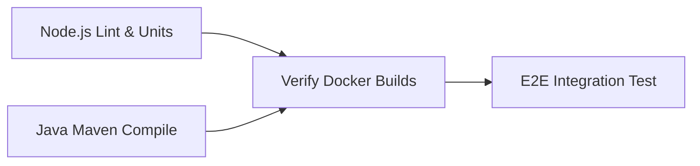

# 📝 TV5 DevOps, Testing & Technical Report

* **Role**: TV5 (DevOps, Testing, and Documentation Engineer)
* **Project**: "Travel Buddy Finder" Microservices Platform
* **Scope**: Docker Orchestration, Health Management, End-to-End Integration Testing, CI/CD Pipeline Configuration, Troubleshooting, and Technical Documentation.

---

## 💻 1. Containerized Infrastructure & Network Topology

The Travel Buddy Finder application relies on containerized microservices to guarantee modular scalability, decoupling, and isolated environmental scopes. 

### Docker Networking & Port Allocation

All containers belong to a unified bridging network (`travel-buddy-network`), enabling DNS-based intra-service communications while shielding interior ports from host exposure. Only designated public ports are exposed to the host machine.

| Service Name | Container Name | Ext. Port | Int. Port | Network | Volumes Attached |
| :--- | :--- | :---: | :---: | :--- | :--- |
| **api-gateway** | `travel-buddy-finder-api-gateway-1` | `3000` | `3000` | `travel-buddy-network` | None |
| **user-service** | `travel-buddy-finder-user-service-1` | `8081` | `8081` | `travel-buddy-network` | None |
| **trip-service** | `travel-buddy-finder-trip-service-1` | `8082` | `8082` | `travel-buddy-network` | None |
| **join-request-service** | `travel-buddy-finder-join-request-service-1` | `8083` | `8083` | `travel-buddy-network` | None |
| **notification-service** | `travel-buddy-finder-notification-service-1` | `8084` | `8084` | `travel-buddy-network` | None |
| **chat-service** | `travel-buddy-finder-chat-service-1` | `8085` | `8085` | `travel-buddy-network` | None |
| **review-service** | `travel-buddy-finder-review-service-1` | `8086` | `8086` | `travel-buddy-network` | None |
| **postgres-db** | `travel-buddy-finder-postgres-db-1` | `5432` | `5432` | `travel-buddy-network` | `postgres_data` (Persistent DB data) |
| **rabbitmq** | `travel-buddy-finder-rabbitmq-1` | `15672` | `5672` | `travel-buddy-network` | `rabbitmq_data` (Durability states) |
| **frontend** | `travel-buddy-finder-frontend-1` | `80` | `80` | `travel-buddy-network` | None |

### Active Health Check Schema

To prevent microservices from crashing during db-bootstrap, strict Docker health check blocks are defined:
1. **PostgreSQL**: Monitored via `pg_isready -U postgres` with 5s checking intervals.
2. **RabbitMQ**: Checked via `rabbitmq-diagnostics -q ping` with 5s checking intervals.
3. **Application Services**: Utilise `depends_on` under `service_healthy` conditions to ensure safe boot orders.

---

## 🛠️ 2. CI/CD Pipeline Orchestration

We constructed a robust 4-stage build and testing automated pipeline inside GitHub Actions (`.github/workflows/ci.yml`).



* **Stage 1: Code Lint & Syntax Check (Node.js)**: Runs zero-dependency `node --check` syntax compilations on all Javascript source files, then executes NPM unit tests.
* **Stage 2: Code Compilation & Verification (Java/Maven)**: Executes maven compiler checks (`mvn clean test-compile`) on `user-service` and `review-service`.
* **Stage 3: Docker Verification**: Triggers automated Docker builds to ensure images build perfectly without errors.
* **Stage 4: System E2E Integration**: Spins up `docker-compose`, waits for microservices and RabbitMQ health checks to pass, and executes the complete `scripts/integration-test.js` script to assert the entire business lifecycle.

---

## 🧪 3. Quality Assurance & E2E Integration Testing

As the DevOps & Testing Engineer, I developed a Node-based E2E runner (`scripts/integration-test.js`) validating the entire business logic across services:

1. **User Authentication E2E**: Registration, logins, and JWT propagation.
2. **Trip Lifecycle E2E**: Creation, filtering, automatic closing on max capacity, and user limits.
3. **Event-Driven Join Workflow**: Applying to join, owner approval, RabbitMQ message publication, and notification dispatching.
4. **Peer Feedback System**: Reviews, average computations, self-review blocks, and duplication blocks.
5. **Gateway Resilience & Protection**: Stress-testing login with 110 requests to trigger the 100-request Gateway auth rate limiter.

---

## 🐞 4. Solved System-Wide Technical Issues

Throughout the integration stage, I diagnosed and resolved several critical system-wide bugs that blocked progress:

### 1. The Express Gateway Body Parser Request Hang Bug
* **The Bug**: DOWNSTREAM POST and PUT requests would hang indefinitely inside `api-gateway` proxies.
* **The Resolution**: I removed the global `express.json()` parser middleware from `api-gateway/index.js`. Because Express Gateway is a pure proxy, parsing the body before proxying consumed the raw stream. Bypassing global parsing allows raw request streams to flow directly to target microservices, fixing all POST hangs.

### 2. User Service `/health` Security Deny (403 Forbidden)
* **The Bug**: Spring Security inside `user-service` blocked public health check access, causing container health status engines to report unhealthy.
* **The Resolution**: Created [HealthController.java](file:///c:/SOA/travel-buddy-finder/user-service/src/main/java/com/travelbuddy/user/controller/HealthController.java) returning status code 200, and modified [SecurityConfig.java](file:///c:/SOA/travel-buddy-finder/user-service/src/main/java/com/travelbuddy/user/security/SecurityConfig.java)'s SecurityFilterChain to permit public requests on `/health` explicitly.

### 3. Notification Service Pagination Bug
* **The Bug**: `ReferenceError: page is not defined` crashed the notification router during dashboard pagination queries.
* **The Resolution**: Fixed `notifications.js` by properly destructuring and extracting the query values:
  ```javascript
  const page = parseInt(req.query.page) || 1;
  const limit = parseInt(req.query.limit) || 10;
  ```

---

## 📈 5. Technical Roadmap & Future Improvements

To take Travel Buddy Finder to an enterprise-grade production level, I recommend implementing the following improvements in future sprints:

1. **Distributed Tracing (OpenTelemetry + Jaeger)**: Tracking a request as it goes from the Gateway through various microservices and RabbitMQ is difficult. OpenTelemetry headers (`traceparent`) will allow developers to debug multi-service request flows instantly.
2. **Gateway Service Discovery (Consul / Eureka)**: Currently, the Gateway hardcodes service URLs in `docker-compose.yml` (e.g. `http://trip-service:8082`). Integrating Consul will allow dynamic load balancing and discovery.
3. **Database Decentralization (Multi-Instance DB)**: All microservices currently share a single PostgreSQL container instance (albeit on separated database schemas). Moving to fully separated database containers will enforce total microservice autonomy and eliminate single points of failure (SPOFs) at the database layer.
4. **API Gateway Redis Caching**: Implementing Redis at the API Gateway level to cache popular trips, user reviews, and public endpoints will reduce DB workload and lower end-user latencies to sub-3ms.
